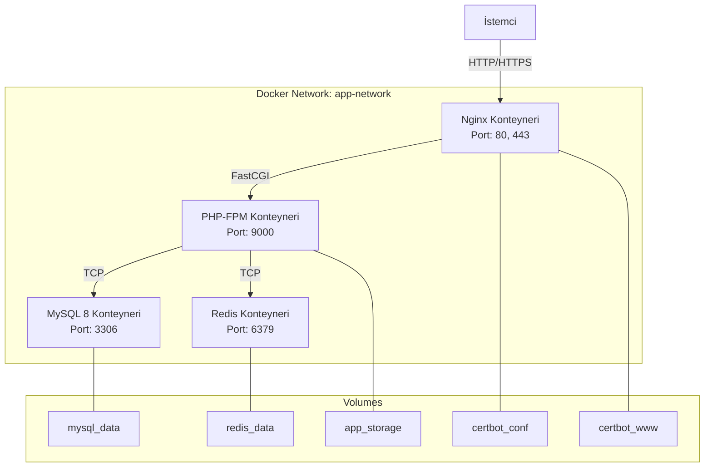

# Teknik Tasarım Dokümanı: Laravel Projesini Dockerize Etme

## Genel Bakış

Bu tasarım dokümanı, Hasibe Çavuşoğlu Psikoloji web sitesinin (Laravel 13 + Filament v5) Docker konteynerlerine taşınması için teknik mimariyi tanımlar. Yapı; PHP-FPM, Nginx, MySQL 8 ve Redis konteynerlerinden oluşan çoklu konteyner mimarisi üzerine kurulmuştur.

### Tasarım Kararları

1. **PHP-FPM + Nginx ayrı konteyner**: Performans ve ölçeklenebilirlik için PHP-FPM ve Nginx ayrı konteynerlerde çalışacaktır.
2. **Multi-stage Dockerfile**: Üretim imajı boyutunu minimize etmek için multi-stage build kullanılacaktır.
3. **Named volumes**: Veritabanı ve Redis verileri için named volume kullanılarak veri kaybı önlenecektir.
4. **Bind-mount (geliştirme)**: Geliştirme ortamında kaynak kod bind-mount ile bağlanarak hot-reload sağlanacaktır.
5. **Makefile**: Sık kullanılan komutlar için kısa yollar tanımlanacaktır.
6. **SSL/Let's Encrypt**: Üretim ortamında certbot ile otomatik sertifika yönetimi sağlanacaktır.

## Mimari

### Konteyner Topolojisi




### Ağ Yapısı

- Tüm konteynerler `app-network` adlı bir bridge network üzerinde iletişim kurar.
- MySQL ve Redis portları yalnızca Docker ağı içinden erişilebilir (dış dünyaya kapalı).
- Nginx konteyneri host makinenin 80 ve 443 portlarını dinler.
- PHP-FPM konteyneri yalnızca Docker ağı içinden 9000 portundan erişilebilir.

### Dosya Yapısı

```
project-root/
├── docker/
│   ├── php/
│   │   ├── Dockerfile
│   │   ├── php.ini
│   │   └── www.conf
│   ├── nginx/
│   │   ├── Dockerfile
│   │   ├── nginx.conf
│   │   └── conf.d/
│   │       ├── default.conf
│   │       └── ssl.conf
│   └── mysql/
│       └── my.cnf
├── docker-compose.yml
├── docker-compose.prod.yml
├── .env.docker
├── Makefile
└── ...
```

## Bileşenler ve Arayüzler

### 1. PHP-FPM Konteyneri (Dockerfile)

**Temel İmaj:** `php:8.3-fpm-alpine`

**Multi-stage Build Stratejisi:**
- Stage 1 (builder): Composer bağımlılıklarını yükler
- Stage 2 (production): Sadece gerekli dosyaları kopyalar

```dockerfile
# ============================================
# Stage 1: Composer Dependencies
# ============================================
FROM composer:2 AS composer-deps

WORKDIR /app
COPY composer.json composer.lock ./
RUN composer install --no-dev --no-scripts --no-autoloader --prefer-dist

# ============================================
# Stage 2: PHP-FPM Production Image
# ============================================
FROM php:8.3-fpm-alpine AS production

# Sistem bağımlılıkları
RUN apk add --no-cache \
    freetype-dev \
    libjpeg-turbo-dev \
    libpng-dev \
    libwebp-dev \
    libzip-dev \
    icu-dev \
    imagemagick-dev \
    pcre-dev \
    linux-headers \
    $PHPIZE_DEPS \
    && pecl install redis imagick \
    && docker-php-ext-enable redis imagick \
    && docker-php-ext-configure gd \
        --with-freetype \
        --with-jpeg \
        --with-webp \
    && docker-php-ext-install -j$(nproc) \
        pdo_mysql \
        mbstring \
        exif \
        pcntl \
        bcmath \
        gd \
        zip \
        intl \
    && apk del $PHPIZE_DEPS linux-headers pcre-dev

# PHP yapılandırması
COPY docker/php/php.ini /usr/local/etc/php/conf.d/custom.ini
COPY docker/php/www.conf /usr/local/etc/php-fpm.d/www.conf

# Çalışma dizini
WORKDIR /var/www/html

# Composer bağımlılıkları
COPY --from=composer-deps /app/vendor ./vendor
COPY --from=composer:2 /usr/bin/composer /usr/bin/composer

# Uygulama dosyaları
COPY . .

# Autoloader optimizasyonu
RUN composer dump-autoload --optimize --no-dev

# Dizin izinleri
RUN chown -R www-data:www-data storage bootstrap/cache \
    && chmod -R 775 storage bootstrap/cache

# Health check
HEALTHCHECK --interval=30s --timeout=5s --retries=3 \
    CMD php-fpm-healthcheck || exit 1

EXPOSE 9000
CMD ["php-fpm"]
```


**PHP Yapılandırması (php.ini):**

```ini
[PHP]
upload_max_filesize = 64M
post_max_size = 64M
memory_limit = 256M
max_execution_time = 60
max_input_time = 60
display_errors = Off
log_errors = On
error_log = /var/log/php/error.log

[Date]
date.timezone = Europe/Istanbul

[opcache]
opcache.enable = 1
opcache.memory_consumption = 128
opcache.max_accelerated_files = 10000
opcache.validate_timestamps = 0
opcache.revalidate_freq = 0
```

**PHP-FPM Pool Yapılandırması (www.conf):**

```ini
[www]
user = www-data
group = www-data
listen = 0.0.0.0:9000
pm = dynamic
pm.max_children = 20
pm.start_servers = 5
pm.min_spare_servers = 3
pm.max_spare_servers = 10
pm.max_requests = 500
pm.status_path = /status
ping.path = /ping
ping.response = pong
```

### 2. Nginx Konteyneri

**Temel İmaj:** `nginx:1.25-alpine`

**Nginx Ana Yapılandırması (nginx.conf):**

```nginx
user nginx;
worker_processes auto;
error_log /var/log/nginx/error.log warn;
pid /var/run/nginx.pid;

events {
    worker_connections 1024;
    multi_accept on;
}

http {
    include /etc/nginx/mime.types;
    default_type application/octet-stream;

    # Logging
    log_format main '$remote_addr - $remote_user [$time_local] "$request" '
                    '$status $body_bytes_sent "$http_referer" '
                    '"$http_user_agent" "$http_x_forwarded_for"';
    access_log /var/log/nginx/access.log main;

    # Performans
    sendfile on;
    tcp_nopush on;
    tcp_nodelay on;
    keepalive_timeout 65;
    types_hash_max_size 2048;
    client_max_body_size 64M;

    # Gzip sıkıştırma
    gzip on;
    gzip_vary on;
    gzip_proxied any;
    gzip_comp_level 6;
    gzip_types
        text/plain
        text/css
        text/xml
        text/javascript
        application/json
        application/javascript
        application/xml
        application/rss+xml
        image/svg+xml;

    include /etc/nginx/conf.d/*.conf;
}
```


**Site Yapılandırması (conf.d/default.conf):**

```nginx
server {
    listen 80;
    server_name _;
    root /var/www/html/public;
    index index.php;

    # Güvenlik başlıkları
    add_header X-Frame-Options "SAMEORIGIN" always;
    add_header X-Content-Type-Options "nosniff" always;
    add_header X-XSS-Protection "1; mode=block" always;
    add_header Referrer-Policy "strict-origin-when-cross-origin" always;

    # Laravel URL yeniden yazma
    location / {
        try_files $uri $uri/ /index.php?$query_string;
    }

    # PHP-FPM proxy
    location ~ \.php$ {
        fastcgi_pass app:9000;
        fastcgi_index index.php;
        fastcgi_param SCRIPT_FILENAME $realpath_root$fastcgi_script_name;
        include fastcgi_params;
        fastcgi_buffering on;
        fastcgi_buffer_size 16k;
        fastcgi_buffers 16 16k;
    }

    # Statik dosyalar - önbellekleme
    location ~* \.(css|js|png|jpg|jpeg|gif|ico|svg|woff|woff2|ttf|eot|otf)$ {
        expires 30d;
        add_header Cache-Control "public, immutable";
        access_log off;
        try_files $uri =404;
    }

    # Gizli dosyaları engelle
    location ~ /\.(?!well-known) {
        deny all;
    }

    # Health check endpoint
    location /health {
        access_log off;
        return 200 'OK';
        add_header Content-Type text/plain;
    }
}
```

**SSL Yapılandırması (conf.d/ssl.conf) - Üretim:**

```nginx
server {
    listen 80;
    server_name hasibecavusoglu.com www.hasibecavusoglu.com;

    # Let's Encrypt challenge
    location /.well-known/acme-challenge/ {
        root /var/www/certbot;
    }

    # HTTP -> HTTPS yönlendirme
    location / {
        return 301 https://$host$request_uri;
    }
}

server {
    listen 443 ssl http2;
    server_name hasibecavusoglu.com www.hasibecavusoglu.com;
    root /var/www/html/public;
    index index.php;

    # SSL sertifikaları
    ssl_certificate /etc/letsencrypt/live/hasibecavusoglu.com/fullchain.pem;
    ssl_certificate_key /etc/letsencrypt/live/hasibecavusoglu.com/privkey.pem;

    # SSL ayarları
    ssl_protocols TLSv1.2 TLSv1.3;
    ssl_ciphers ECDHE-ECDSA-AES128-GCM-SHA256:ECDHE-RSA-AES128-GCM-SHA256;
    ssl_prefer_server_ciphers off;
    ssl_session_cache shared:SSL:10m;
    ssl_session_timeout 1d;

    # HSTS
    add_header Strict-Transport-Security "max-age=63072000" always;

    # Güvenlik başlıkları
    add_header X-Frame-Options "SAMEORIGIN" always;
    add_header X-Content-Type-Options "nosniff" always;

    # Laravel URL yeniden yazma
    location / {
        try_files $uri $uri/ /index.php?$query_string;
    }

    location ~ \.php$ {
        fastcgi_pass app:9000;
        fastcgi_index index.php;
        fastcgi_param SCRIPT_FILENAME $realpath_root$fastcgi_script_name;
        include fastcgi_params;
    }

    location ~* \.(css|js|png|jpg|jpeg|gif|ico|svg|woff|woff2|ttf|eot|otf)$ {
        expires 30d;
        add_header Cache-Control "public, immutable";
        access_log off;
    }

    location ~ /\.(?!well-known) {
        deny all;
    }
}
```


### 3. Docker Compose Yapılandırması

**docker-compose.yml (Geliştirme):**

```yaml
services:
  # PHP-FPM Uygulama Konteyneri
  app:
    build:
      context: .
      dockerfile: docker/php/Dockerfile
      target: production
    container_name: hc_app
    restart: unless-stopped
    working_dir: /var/www/html
    volumes:
      - .:/var/www/html
      - vendor_data:/var/www/html/vendor
      - storage_data:/var/www/html/storage/app
    environment:
      - APP_ENV=${APP_ENV:-local}
    env_file:
      - .env
    depends_on:
      mysql:
        condition: service_healthy
      redis:
        condition: service_healthy
    networks:
      - app-network
    healthcheck:
      test: ["CMD-SHELL", "php-fpm-healthcheck || exit 1"]
      interval: 30s
      timeout: 5s
      retries: 3
      start_period: 30s

  # Nginx Web Sunucusu
  nginx:
    image: nginx:1.25-alpine
    container_name: hc_nginx
    restart: unless-stopped
    ports:
      - "80:80"
      - "443:443"
    volumes:
      - .:/var/www/html:ro
      - ./docker/nginx/nginx.conf:/etc/nginx/nginx.conf:ro
      - ./docker/nginx/conf.d:/etc/nginx/conf.d:ro
      - certbot_conf:/etc/letsencrypt:ro
      - certbot_www:/var/www/certbot:ro
    depends_on:
      app:
        condition: service_healthy
    networks:
      - app-network
    healthcheck:
      test: ["CMD", "wget", "--quiet", "--tries=1", "--spider", "http://localhost/health"]
      interval: 30s
      timeout: 5s
      retries: 3

  # MySQL 8 Veritabanı
  mysql:
    image: mysql:8.0
    container_name: hc_mysql
    restart: unless-stopped
    environment:
      MYSQL_ROOT_PASSWORD: ${DB_PASSWORD:-secret}
      MYSQL_DATABASE: ${DB_DATABASE:-hasibe_cavusoglu_db}
      MYSQL_USER: ${DB_USERNAME:-laravel}
      MYSQL_PASSWORD: ${DB_PASSWORD:-secret}
    volumes:
      - mysql_data:/var/lib/mysql
      - ./docker/mysql/my.cnf:/etc/mysql/conf.d/custom.cnf:ro
    networks:
      - app-network
    healthcheck:
      test: ["CMD", "mysqladmin", "ping", "-h", "localhost", "-u", "root", "-p${DB_PASSWORD:-secret}"]
      interval: 10s
      timeout: 5s
      retries: 5
      start_period: 30s

  # Redis Önbellek/Oturum
  redis:
    image: redis:7-alpine
    container_name: hc_redis
    restart: unless-stopped
    command: redis-server --appendonly yes
    volumes:
      - redis_data:/data
    networks:
      - app-network
    healthcheck:
      test: ["CMD", "redis-cli", "ping"]
      interval: 10s
      timeout: 3s
      retries: 5

networks:
  app-network:
    driver: bridge

volumes:
  mysql_data:
    driver: local
  redis_data:
    driver: local
  vendor_data:
    driver: local
  storage_data:
    driver: local
  certbot_conf:
    driver: local
  certbot_www:
    driver: local
```


**docker-compose.prod.yml (Üretim Override):**

```yaml
services:
  app:
    build:
      target: production
    volumes:
      - storage_data:/var/www/html/storage/app
    environment:
      - APP_ENV=production
      - APP_DEBUG=false

  nginx:
    ports:
      - "80:80"
      - "443:443"

  # Let's Encrypt Certbot
  certbot:
    image: certbot/certbot
    container_name: hc_certbot
    volumes:
      - certbot_conf:/etc/letsencrypt
      - certbot_www:/var/www/certbot
    entrypoint: "/bin/sh -c 'trap exit TERM; while :; do certbot renew; sleep 12h & wait $${!}; done;'"
```

### 4. MySQL Yapılandırması (my.cnf)

```ini
[mysqld]
character-set-server = utf8mb4
collation-server = utf8mb4_unicode_ci
default-authentication-plugin = mysql_native_password
innodb_buffer_pool_size = 256M
max_connections = 100
sql_mode = STRICT_TRANS_TABLES,NO_ZERO_IN_DATE,NO_ZERO_DATE,ERROR_FOR_DIVISION_BY_ZERO,NO_ENGINE_SUBSTITUTION

[client]
default-character-set = utf8mb4
```

## Veri Modelleri

### Volume Stratejisi

| Volume | Amaç | Tip | Kullanıcı |
|--------|-------|-----|-----------|
| `mysql_data` | MySQL veritabanı verileri | Named volume | MySQL konteyneri |
| `redis_data` | Redis kalıcı verileri | Named volume | Redis konteyneri |
| `vendor_data` | Composer bağımlılıkları | Named volume | PHP-FPM konteyneri |
| `storage_data` | Yüklenen dosyalar (media) | Named volume | PHP-FPM konteyneri |
| `certbot_conf` | SSL sertifikaları | Named volume | Nginx + Certbot |
| `certbot_www` | ACME challenge dosyaları | Named volume | Nginx + Certbot |
| `.` (bind-mount) | Kaynak kod (geliştirme) | Bind mount | PHP-FPM + Nginx |

### Ortam Değişkeni Eşleme (.env.docker)

```env
# Uygulama
APP_NAME="Hasibe Çavuşoğlu Psikoloji"
APP_ENV=local
APP_KEY=
APP_DEBUG=true
APP_URL=http://localhost

APP_LOCALE=tr
APP_FALLBACK_LOCALE=tr
APP_FAKER_LOCALE=tr_TR

# Veritabanı (Docker servis adı kullanılır)
DB_CONNECTION=mysql
DB_HOST=mysql
DB_PORT=3306
DB_DATABASE=hasibe_cavusoglu_db
DB_USERNAME=laravel
DB_PASSWORD=secret

# Redis (Docker servis adı kullanılır)
REDIS_CLIENT=phpredis
REDIS_HOST=redis
REDIS_PASSWORD=null
REDIS_PORT=6379

# Oturum ve Önbellek - Redis kullan
SESSION_DRIVER=redis
CACHE_STORE=redis
QUEUE_CONNECTION=redis

# Mail
MAIL_MAILER=smtp
MAIL_HOST=mailhog
MAIL_PORT=1025
MAIL_USERNAME=null
MAIL_PASSWORD=null
MAIL_FROM_ADDRESS="info@hasibecavusoglu.com"
MAIL_FROM_NAME="${APP_NAME}"

# Dosya Sistemi
FILESYSTEM_DISK=local

# Log
LOG_CHANNEL=stack
LOG_STACK=single
LOG_LEVEL=debug
```


### Makefile Komutları

```makefile
# ============================================
# Hasibe Çavuşoğlu - Docker Makefile
# ============================================

.PHONY: help up down build restart logs shell artisan migrate fresh seed composer test

# Varsayılan hedef
help: ## Yardım menüsünü göster
	@grep -E '^[a-zA-Z_-]+:.*?## .*$$' $(MAKEFILE_LIST) | sort | \
		awk 'BEGIN {FS = ":.*?## "}; {printf "\033[36m%-20s\033[0m %s\n", $$1, $$2}'

# === Konteyner Yönetimi ===

up: ## Tüm konteynerleri başlat
	docker compose up -d

down: ## Tüm konteynerleri durdur
	docker compose down

build: ## Docker imajlarını yeniden oluştur
	docker compose build --no-cache

restart: ## Konteynerleri yeniden başlat
	docker compose restart

logs: ## Konteyner loglarını göster
	docker compose logs -f

logs-app: ## PHP konteyner loglarını göster
	docker compose logs -f app

logs-nginx: ## Nginx loglarını göster
	docker compose logs -f nginx

# === Uygulama Komutları ===

shell: ## PHP konteynerine shell erişimi
	docker compose exec app sh

artisan: ## Artisan komutu çalıştır (kullanım: make artisan cmd="migrate")
	docker compose exec app php artisan $(cmd)

migrate: ## Migration'ları çalıştır
	docker compose exec app php artisan migrate

fresh: ## Veritabanını sıfırla ve yeniden oluştur
	docker compose exec app php artisan migrate:fresh --seed

seed: ## Seeder'ları çalıştır
	docker compose exec app php artisan db:seed

composer: ## Composer komutu çalıştır (kullanım: make composer cmd="install")
	docker compose exec app composer $(cmd)

# === Bakım ===

cache-clear: ## Tüm önbellekleri temizle
	docker compose exec app php artisan optimize:clear

optimize: ## Uygulama önbelleklerini oluştur
	docker compose exec app php artisan optimize

permissions: ## Dosya izinlerini düzelt
	docker compose exec app chown -R www-data:www-data storage bootstrap/cache
	docker compose exec app chmod -R 775 storage bootstrap/cache

# === Üretim ===

prod-up: ## Üretim ortamını başlat
	docker compose -f docker-compose.yml -f docker-compose.prod.yml up -d

prod-down: ## Üretim ortamını durdur
	docker compose -f docker-compose.yml -f docker-compose.prod.yml down

ssl-init: ## İlk SSL sertifikasını al
	docker compose run --rm certbot certonly \
		--webroot --webroot-path=/var/www/certbot \
		--email admin@hasibecavusoglu.com \
		--agree-tos --no-eff-email \
		-d hasibecavusoglu.com -d www.hasibecavusoglu.com

ssl-renew: ## SSL sertifikasını yenile
	docker compose run --rm certbot renew

# === Test ===

test: ## PHPUnit testlerini çalıştır
	docker compose exec app php artisan test

# === İlk Kurulum ===

install: ## İlk kurulum (tüm adımlar)
	@make build
	@make up
	@sleep 10
	docker compose exec app composer install
	docker compose exec app cp .env.docker .env
	docker compose exec app php artisan key:generate
	docker compose exec app php artisan migrate --seed
	docker compose exec app php artisan storage:link
	@make permissions
	@echo "✅ Kurulum tamamlandı! http://localhost adresini ziyaret edin."
```


## Hata Yönetimi

### Konteyner Başlatma Hataları

| Hata Durumu | Çözüm |
|-------------|-------|
| MySQL bağlantı hatası | `depends_on` + `service_healthy` ile MySQL hazır olana kadar beklenir |
| Redis bağlantı hatası | `depends_on` + `service_healthy` ile Redis hazır olana kadar beklenir |
| .env dosyası eksik | Konteyner başlatma sırasında `env_file` direktifi ile hata verilir |
| Dizin izin hatası | Entrypoint script ile storage/bootstrap/cache izinleri düzeltilir |
| Port çakışması | Docker Compose loglarında net hata mesajı gösterilir |

### Health Check Mekanizmaları

| Konteyner | Health Check | Interval | Timeout | Retries |
|-----------|-------------|----------|---------|---------|
| PHP-FPM | `php-fpm-healthcheck` (ping.path) | 30s | 5s | 3 |
| Nginx | `wget --spider http://localhost/health` | 30s | 5s | 3 |
| MySQL | `mysqladmin ping` | 10s | 5s | 5 |
| Redis | `redis-cli ping` | 10s | 3s | 5 |

### Yeniden Başlatma Politikası

Tüm konteynerler `restart: unless-stopped` politikasıyla yapılandırılır:
- Konteyner çökerse otomatik yeniden başlatılır
- Health check başarısız olursa Docker daemon yeniden başlatma tetikler
- `docker compose down` ile açıkça durdurulduğunda yeniden başlatılmaz

### Log Stratejisi

- PHP hataları: `/var/log/php/error.log` (konteyner içi) + `docker compose logs app`
- Nginx erişim/hata logları: `/var/log/nginx/` + `docker compose logs nginx`
- Laravel logları: `storage/logs/laravel.log` (bind-mount ile host'tan erişilebilir)
- MySQL logları: `docker compose logs mysql`

## Test Stratejisi

### PBT Uygulanabilirlik Değerlendirmesi

Bu özellik bir **Infrastructure as Code (IaC) / Docker yapılandırması** olduğu için Property-Based Testing (PBT) uygun **değildir**. Sebepler:

1. Docker yapılandırması deklaratif bir konfigürasyondur, girdi/çıktı olan bir fonksiyon değildir
2. Konteyner davranışı belirleyici (deterministic) ve yapılandırmaya bağımlıdır
3. Test edilecek "evrensel özellik" yoktur — ya çalışır ya çalışmaz
4. Yüz iterasyon çalıştırmak 1-2 iterasyondan fazla hata bulmaz

### Önerilen Test Yaklaşımı

#### 1. Smoke Testleri (Duman Testleri)

Her konteyner için temel çalışma kontrolü:

- **PHP-FPM**: `docker compose exec app php -v` ile PHP sürüm kontrolü
- **Nginx**: `curl -f http://localhost/health` ile HTTP 200 kontrolü
- **MySQL**: `docker compose exec mysql mysqladmin ping` ile bağlantı kontrolü
- **Redis**: `docker compose exec redis redis-cli ping` ile PONG yanıt kontrolü
- **Laravel**: `docker compose exec app php artisan about` ile uygulama durumu kontrolü

#### 2. Entegrasyon Testleri

Konteynerler arası iletişim doğrulaması:

- PHP → MySQL bağlantısı: `docker compose exec app php artisan migrate:status`
- PHP → Redis bağlantısı: `docker compose exec app php artisan tinker --execute="Redis::ping()"`
- Nginx → PHP-FPM proxy: `curl http://localhost` ile ana sayfa erişimi
- Statik dosya servisi: `curl http://localhost/css/style.css` ile 200 yanıtı
- SSL yönlendirme (üretim): HTTP → HTTPS 301 kontrolü

#### 3. Yapılandırma Doğrulama Testleri

- PHP uzantıları: `docker compose exec app php -m | grep -E "pdo_mysql|redis|gd|imagick"`
- PHP ayarları: `docker compose exec app php -i | grep upload_max_filesize`
- MySQL karakter seti: `docker compose exec mysql mysql -e "SHOW VARIABLES LIKE 'character_set%'"`
- Volume kalıcılığı: Konteyner yeniden başlatma sonrası veri kontrolü

#### 4. Manuel Test Senaryoları

- Tam kurulum akışı: `make install` ile sıfırdan kurulum
- Dosya yükleme: Filament admin panelinden medya yükleme
- Mail gönderimi: İletişim formu üzerinden mail kontrolü
- Queue worker: `make artisan cmd="queue:work --once"` ile iş kuyruğu testi
