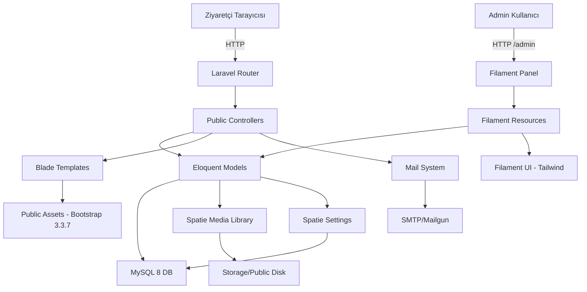
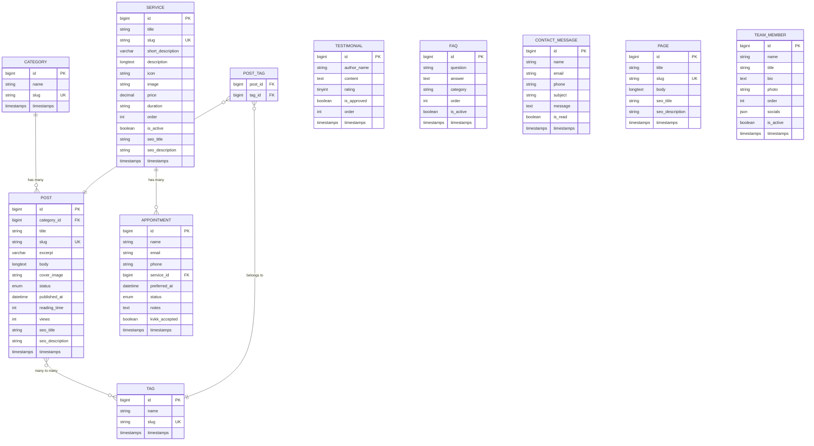

# Design Document: Laravel Filament Psikolog Web

## Overview

Bu doküman, Optima psikoloji HTML şablonunun Laravel 11 + Filament v3 uygulamasına dönüştürülmesinin teknik tasarımını tanımlar. Proje, mevcut statik HTML şablonunu (Bootstrap 3.3.7, jQuery 2.2.4, Owl Carousel, SuperFish) koruyarak dinamik bir CMS altyapısına kavuşturacaktır.

### Temel Tasarım Kararları

1. **Frontend-Backend Ayrımı**: Public frontend orijinal Bootstrap 3.3.7 şablonunu Blade template olarak kullanır. Admin panel ise Filament v3'ün kendi Tailwind tabanlı arayüzünü kullanır. İki katman birbirinden tamamen bağımsızdır.
2. **Spatie Ekosistemi**: Slug, media, settings yönetimi için Spatie paketleri tercih edilmiştir. Bu Laravel ekosisteminde en olgun ve iyi test edilmiş çözümlerdir.
3. **Filament Shield**: Rol tabanlı erişim için ayrı bir RBAC sistemi yazmak yerine, Filament Shield ile Filament'in kendi policy mekanizması kullanılır.
4. **Asset Stratejisi**: Şablon varlıkları (CSS, JS, img, fonts) doğrudan `public/` dizinine kopyalanır. Vite/Mix gibi bundler KULLANILMAZ, çünkü orijinal şablonun bütünlüğü korunmalıdır.
5. **Türkçe İçerik**: Tüm frontend içerik, URL slug'ları ve admin panel etiketleri Türkçe olacaktır.

## Architecture

### Katmanlı Mimari



### Dizin Yapısı

```
hasibe_cavusoglu_web/
├── app/
│   ├── Filament/
│   │   ├── Resources/          # Filament CRUD Resources
│   │   ├── Pages/              # Settings Page
│   │   └── Widgets/            # Dashboard Widgets
│   ├── Http/
│   │   └── Controllers/        # Public Frontend Controllers
│   ├── Mail/                   # Mailable sınıfları
│   ├── Models/                 # Eloquent Models
│   ├── Policies/               # Shield Policies
│   ├── Providers/
│   └── Settings/               # Spatie Settings sınıfları
├── config/
├── database/
│   ├── migrations/
│   ├── seeders/
│   └── settings/               # Spatie settings migrations
├── public/
│   ├── css/                    # Bootstrap 3.3.7, FA, style.css
│   ├── js/                     # jQuery, plugins, main.js
│   ├── img/                    # Template images
│   └── fonts/                  # Template fonts
├── resources/
│   ├── views/
│   │   ├── layouts/
│   │   │   ├── app.blade.php
│   │   │   └── partials/
│   │   │       ├── header.blade.php
│   │   │       ├── footer.blade.php
│   │   │       └── meta.blade.php
│   │   ├── pages/              # Public page views
│   │   ├── components/         # Blade components
│   │   ├── emails/             # Email templates
│   │   └── errors/             # 404, 500
│   └── lang/
│       └── tr/                 # Türkçe dil dosyaları
├── routes/
│   └── web.php                 # Public routes
└── storage/
```

### Request Akışı

**Public Frontend:**
```
Tarayıcı → Route (web.php) → Controller → Model/Settings → Blade View → HTML Response
```

**Admin Panel:**
```
Tarayıcı → Filament Route (/admin) → Auth Middleware → Shield Policy → Resource → Form/Table → Response
```

**E-posta:**
```
Form Submit → Controller Validation → Model Create → Event/Observer → Mailable Queue → SMTP
```

### Paket Bağımlılıkları

| Paket | Versiyon | Amaç |
|-------|----------|------|
| laravel/framework | ^11.0 | Ana framework |
| filament/filament | ^3.2 | Admin panel |
| spatie/laravel-sluggable | ^3.6 | Otomatik slug üretimi |
| spatie/laravel-medialibrary | ^11.0 | Dosya/resim yönetimi |
| spatie/laravel-settings | ^3.3 | Site ayarları |
| filament/spatie-laravel-media-library-plugin | ^3.2 | Filament media entegrasyonu |
| bezhansalleh/filament-shield | ^3.2 | Rol tabanlı erişim |
| spatie/laravel-sitemap | ^7.2 | Sitemap oluşturma |

## Components and Interfaces

### 1. Public Controllers

```php
// app/Http/Controllers/
├── HomeController          # Anasayfa: hero, services, posts, testimonials
├── AboutController         # Hakkımda sayfası
├── ServiceController       # Hizmetler listesi ve detay
├── BlogController          # Blog listesi, detay, kategori filtre
├── FaqController           # SSS sayfası
├── AppointmentController   # Randevu formu gösterim ve submit
├── ContactController       # İletişim formu gösterim ve submit
├── PageController          # Dinamik statik sayfalar (KVKK vb.)
└── SitemapController       # sitemap.xml oluşturma
```

#### Controller Interface Örnekleri

```php
class HomeController extends Controller
{
    public function index(): View
    {
        // SiteSettings'den hero bilgileri
        // Aktif hizmetler (sıralı)
        // Son 3 yayınlanan blog yazısı
        // Onaylı testimonial'lar
        return view('pages.home', compact('services', 'posts', 'testimonials'));
    }
}

class AppointmentController extends Controller
{
    public function create(): View
    {
        $services = Service::active()->get();
        return view('pages.appointment', compact('services'));
    }

    public function store(AppointmentRequest $request): RedirectResponse
    {
        $appointment = Appointment::create($request->validated());
        Mail::to(app(SiteSettings::class)->email)->send(new AppointmentReceivedMailable($appointment));
        Mail::to($appointment->email)->send(new AppointmentConfirmationMailable($appointment));
        return back()->with('success', 'Randevu talebiniz alınmıştır.');
    }
}
```

### 2. Form Request'ler

```php
// app/Http/Requests/
├── ContactRequest          # name, email, phone?, subject?, message(min:10), kvkk
└── AppointmentRequest      # name, email, phone, service_id, preferred_at(after:now), notes?, kvkk
```

### 3. Filament Resources

```php
// app/Filament/Resources/
├── ServiceResource         # CRUD + reorder + is_active toggle
├── PostResource            # CRUD + publish toggle + status badge
├── CategoryResource        # CRUD + posts_count
├── TagResource             # CRUD + posts_count
├── TestimonialResource     # CRUD + approve toggle + reorder
├── FaqResource             # CRUD + is_active toggle + reorder
├── AppointmentResource     # CRUD + status actions + email triggers
├── ContactMessageResource  # Read-only + mark-as-read action
├── PageResource            # CRUD + RichEditor
└── TeamMemberResource      # CRUD + reorder + socials repeater
```

### 4. Filament Pages & Widgets

```php
// app/Filament/Pages/
└── ManageSiteSettings      # SiteSettings form page

// app/Filament/Widgets/
├── PendingAppointmentsWidget   # Bekleyen randevu sayacı
├── UnreadMessagesWidget        # Okunmamış mesaj sayacı
└── RecentPostsWidget           # Son 5 yayınlanan yazı listesi
```

### 5. Mailable Sınıfları

```php
// app/Mail/
├── ContactFormMailable             # Admin'e iletişim bildirimi
├── AppointmentReceivedMailable     # Müşteriye randevu alındı bildirimi
├── AppointmentConfirmedMailable    # Müşteriye randevu onay bildirimi
└── AppointmentCancelledMailable    # Müşteriye randevu iptal bildirimi
```

### 6. Blade Component'ler

```php
// resources/views/components/
├── meta-tags.blade.php        # Dinamik SEO meta, OG, Twitter Card
├── schema-org.blade.php       # Schema.org yapılandırılmış veri
├── breadcrumb.blade.php       # Sayfa breadcrumb
├── service-card.blade.php     # Hizmet kartı
├── post-card.blade.php        # Blog yazısı kartı
├── testimonial-item.blade.php # Testimonial slider item
└── faq-item.blade.php         # Accordion FAQ item
```

### 7. Settings Sınıfı

```php
// app/Settings/SiteSettings.php
class SiteSettings extends Settings
{
    public ?string $logo;
    public ?string $favicon;
    public string $phone;
    public ?string $whatsapp;
    public string $email;
    public string $address;
    public ?string $map_embed;
    public array $working_hours;
    public array $social_links;
    public string $hero_title;
    public string $hero_subtitle;
    public string $hero_cta_text;
    public string $footer_text;
    public ?string $ga_id;
    public ?string $default_meta_description;

    public static function group(): string
    {
        return 'site';
    }
}
```

### 8. Route Tanımları

```php
// routes/web.php
Route::get('/', [HomeController::class, 'index'])->name('home');
Route::get('/hakkimda', [AboutController::class, 'index'])->name('about');
Route::get('/hizmetler', [ServiceController::class, 'index'])->name('services.index');
Route::get('/hizmetler/{slug}', [ServiceController::class, 'show'])->name('services.show');
Route::get('/blog', [BlogController::class, 'index'])->name('blog.index');
Route::get('/blog/{slug}', [BlogController::class, 'show'])->name('blog.show');
Route::get('/sss', [FaqController::class, 'index'])->name('faq');
Route::get('/randevu', [AppointmentController::class, 'create'])->name('appointment.create');
Route::post('/randevu', [AppointmentController::class, 'store'])->name('appointment.store');
Route::get('/iletisim', [ContactController::class, 'create'])->name('contact.create');
Route::post('/iletisim', [ContactController::class, 'store'])->name('contact.store');
Route::get('/sayfa/{slug}', [PageController::class, 'show'])->name('page.show');
Route::get('/sitemap.xml', [SitemapController::class, 'index'])->name('sitemap');
```

### 9. Middleware

- `web` middleware grubu tüm public route'lara uygulanır
- Filament kendi auth middleware'ini yönetir (`auth`, `verified`)
- Shield policy'leri Filament resource seviyesinde çalışır
- Rate limiting: iletişim ve randevu formları için `throttle:5,1` (dakikada 5 istek)

## Data Models

### ER Diyagramı



### Model İlişkileri

| Model | İlişki | Hedef | Tip |
|-------|--------|-------|-----|
| Post | belongsTo | Category | N:1 |
| Post | belongsToMany | Tag | N:N (post_tag pivot) |
| Category | hasMany | Post | 1:N |
| Tag | belongsToMany | Post | N:N |
| Appointment | belongsTo | Service | N:1 |
| Service | hasMany | Appointment | 1:N |

### Enum Tanımları

```php
// app/Enums/PostStatus.php
enum PostStatus: string
{
    case Draft = 'draft';
    case Published = 'published';
}

// app/Enums/AppointmentStatus.php
enum AppointmentStatus: string
{
    case Pending = 'pending';
    case Confirmed = 'confirmed';
    case Cancelled = 'cancelled';
    case Completed = 'completed';
}
```

### Scope'lar

| Model | Scope | Açıklama |
|-------|-------|----------|
| Service | `active()` | `where('is_active', true)->orderBy('order')` |
| Post | `published()` | `where('status', 'published')->whereNotNull('published_at')->where('published_at', '<=', now())` |
| Testimonial | `approved()` | `where('is_approved', true)->orderBy('order')` |
| FAQ | `active()` | `where('is_active', true)->orderBy('order')` |
| TeamMember | `active()` | `where('is_active', true)->orderBy('order')` |

### SiteSettings Spatie Migration

```php
// database/settings/create_site_settings.php
return new class extends SettingsMigration
{
    public function up(): void
    {
        $this->migrator->add('site.logo', null);
        $this->migrator->add('site.favicon', null);
        $this->migrator->add('site.phone', '');
        $this->migrator->add('site.whatsapp', null);
        $this->migrator->add('site.email', '');
        $this->migrator->add('site.address', '');
        $this->migrator->add('site.map_embed', null);
        $this->migrator->add('site.working_hours', []);
        $this->migrator->add('site.social_links', []);
        $this->migrator->add('site.hero_title', '');
        $this->migrator->add('site.hero_subtitle', '');
        $this->migrator->add('site.hero_cta_text', 'Randevu Al');
        $this->migrator->add('site.footer_text', '');
        $this->migrator->add('site.ga_id', null);
        $this->migrator->add('site.default_meta_description', '');
    }
};
```

## Correctness Properties

*A property is a characteristic or behavior that should hold true across all valid executions of a system-essentially, a formal statement about what the system should do. Properties serve as the bridge between human-readable specifications and machine-verifiable correctness guarantees.*

### Property 1: Active/Approved Scope Filtresi Doğruluğu

*For any* koleksiyondaki kayıt seti ve `active()` veya `approved()` scope'u uygulandığında, dönen tüm kayıtların ilgili boolean alanı (is_active veya is_approved) true olmalı VE hiçbir false kayıt sonuçlarda bulunmamalı VE sonuçlar order alanına göre artan sırada olmalıdır.

**Validates: Requirements 4.1, 4.4, 4.5, 4.9**

### Property 2: Published Scope Filtresi Doğruluğu

*For any* Post koleksiyonu için `published()` scope'u uygulandığında, dönen tüm kayıtların status alanı 'published' olmalı VE published_at alanı null olmamalı VE published_at değeri şimdiki zamandan küçük veya eşit olmalıdır. Ayrıca bu koşullardan herhangi birini sağlamayan kayıtlar sonuçlarda bulunmamalıdır.

**Validates: Requirements 4.2**

### Property 3: Blog Yazısı Görüntülenme Sayacı

*For any* yayınlanmış blog yazısı için, detay sayfası her ziyaret edildiğinde views alanı tam olarak 1 artmalıdır. Başlangıç views değeri n ise, k ziyaret sonrası views değeri n+k olmalıdır.

**Validates: Requirements 9.6**

### Property 4: İletişim Formu Geçerli Veri → Kayıt Oluşturma

*For any* geçerli iletişim formu verisi (non-empty name, valid email, message min 10 karakter, kvkk=true), form submit edildiğinde veritabanında tam olarak bir yeni Contact_Message kaydı oluşturulmalı ve bu kayıt gönderilen verilerle birebir eşleşmelidir.

**Validates: Requirements 10.2**

### Property 5: Form Validasyon Reddi ve Değer Korunması

*For any* geçersiz iletişim veya randevu formu verisi (boş zorunlu alan, geçersiz email formatı, kısa mesaj), form submit edildiğinde veritabanında yeni kayıt oluşturulmamalı VE response validation hata mesajları içermeli VE daha önce girilen geçerli değerler old input olarak korunmalıdır.

**Validates: Requirements 10.5, 11.6, 11.7**

### Property 6: Randevu Oluşturma ile Pending Status

*For any* geçerli randevu formu verisi (geçerli email, telefon, gelecek tarih, aktif service_id, kvkk=true), form submit edildiğinde veritabanında status='pending' olan tam olarak bir yeni Appointment kaydı oluşturulmalıdır.

**Validates: Requirements 11.2**

### Property 7: Geçmiş Tarih Reddi

*For any* randevu formu gönderiminde preferred_at değeri şu anki zamandan önce ise, form reddedilmeli ve veritabanında yeni Appointment kaydı oluşturulmamalıdır.

**Validates: Requirements 11.6**

### Property 8: Meta Tag Fallback Mekanizması

*For any* public sayfa ve içerik kaydı için, eğer kaydın seo_title/seo_description alanları dolu ise bu değerler meta tag'larda kullanılmalı; eğer boş ise SiteSettings.default_meta_description değeri kullanılmalıdır. Hiçbir durumda meta tag'lar boş kalmamalıdır (SiteSettings default'u dolu olduğu sürece).

**Validates: Requirements 12.1**

### Property 9: Mailable İçerik Bütünlüğü

*For any* Contact_Message veya Appointment kaydı için, ilgili Mailable oluşturulduğunda e-posta içeriği kaynak kaydın tüm zorunlu alanlarını (name, email, phone, subject/service, date) içermelidir.

**Validates: Requirements 15.1, 15.2**

## Error Handling

### Form Validation Hataları

| Senaryo | Davranış |
|---------|----------|
| Zorunlu alan boş | Field-specific validation error mesajı, old input korunur |
| Geçersiz email formatı | "Geçerli bir e-posta adresi giriniz" hatası |
| Mesaj 10 karakterden kısa | Min length validation hatası |
| Geçmiş tarih (randevu) | "Randevu tarihi gelecekte olmalıdır" hatası |
| KVKK onayı verilmemiş | "KVKK onayı zorunludur" hatası |
| Geçersiz service_id | "Seçilen hizmet bulunamadı" hatası |

### E-posta Gönderim Hataları

```php
// Mail gönderiminde try-catch ile hata yönetimi
try {
    Mail::to($recipient)->send($mailable);
} catch (\Exception $e) {
    Log::error('Mail gönderimi başarısız', [
        'to' => $recipient,
        'mailable' => get_class($mailable),
        'error' => $e->getMessage(),
    ]);
    // Kullanıcı akışı kesilmez, hata loglanır
}
```

### 404 Hataları

- Olmayan slug ile erişim → Özel 404 sayfası (template tasarımıyla uyumlu)
- `findOrFail()` ve `firstOrFail()` ile ModelNotFoundException yakalanır
- Route model binding kullanılmaz (slug bazlı manual lookup tercih edilir)

### Rate Limiting

```php
// iletişim ve randevu formları için throttle
Route::middleware('throttle:5,1')->group(function () {
    Route::post('/iletisim', [ContactController::class, 'store']);
    Route::post('/randevu', [AppointmentController::class, 'store']);
});
```

### Database Constraint Hataları

- Unique slug ihlali → Spatie sluggable otomatik suffix ekler (title-1, title-2)
- Foreign key ihlali (silinmiş service'e bağlı appointment) → `nullOnDelete()` ile handle edilir

### Media Upload Hataları

- Max dosya boyutu aşımı → Filament FileUpload validation
- Desteklenmeyen dosya tipi → Accepted file types validation
- Storage disk dolu → Exception loglanır, kullanıcıya hata mesajı

## Testing Strategy

### Test Araçları

- **PHPUnit/Pest**: Unit ve feature testleri
- **Pest Plugin for Laravel**: Laravel-specific test helpers
- **PestPHP Property Testing (pest-plugin-faker + data providers)**: Property-based test yaklaşımı
- **Laravel Dusk** (opsiyonel): Browser testleri

### Test Katmanları

#### 1. Unit Testler

```
tests/Unit/
├── Models/
│   ├── ServiceTest.php         # Scope, cast, attribute testleri
│   ├── PostTest.php            # Published scope, relationships
│   ├── AppointmentTest.php     # Status enum, relationships
│   └── ...
├── Settings/
│   └── SiteSettingsTest.php    # Settings read/write
└── Mail/
    ├── ContactFormMailableTest.php
    └── AppointmentMailableTest.php
```

#### 2. Feature Testler

```
tests/Feature/
├── Controllers/
│   ├── HomeControllerTest.php
│   ├── BlogControllerTest.php      # Views increment
│   ├── ContactControllerTest.php   # Form validation, submission
│   ├── AppointmentControllerTest.php
│   └── ...
├── Filament/
│   ├── ServiceResourceTest.php
│   ├── PostResourceTest.php
│   ├── AppointmentResourceTest.php # Status change + mail
│   └── ...
└── Middleware/
    └── ThrottleTest.php
```

#### 3. Property-Based Testler

```
tests/Property/
├── ScopeFilteringTest.php     # Property 1, 2
├── ViewsCounterTest.php       # Property 3
├── ContactFormTest.php        # Property 4, 5
├── AppointmentFormTest.php    # Property 6, 7
├── MetaTagFallbackTest.php   # Property 8
└── MailableContentTest.php    # Property 9
```

### Property Test Konfigürasyonu

- Minimum **100 iterasyon** per property test
- Her property test, design dokümanındaki property numarasını referans eder
- Tag format: `/** Feature: laravel-filament-psikolog-web, Property {number}: {title} */`
- Faker ile random veri üretimi (Türkçe locale: `tr_TR`)

### Test Önceliklendirme

1. **Kritik**: Form submission (contact + appointment), validation, mail triggers
2. **Yüksek**: Scope filtering, views counter, role-based access
3. **Normal**: CRUD operations, seeder, asset paths
4. **Düşük**: SEO meta tags, sitemap generation
